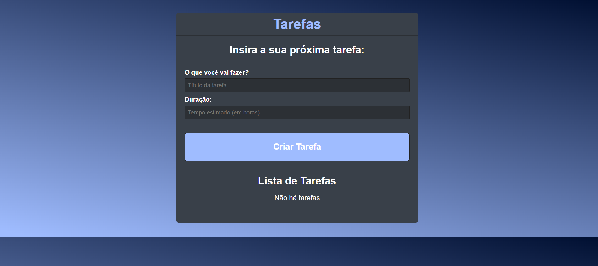

## 📋 Tarefas App

Este é um projeto simples de gerenciamento de tarefas desenvolvido com **React.js**. Ele permite que os usuários criem, visualizem, atualizem e excluam tarefas, com funcionalidades como marcar uma tarefa como concluída e exibir a duração estimada de cada tarefa.

### 🖼️ **Imagens**


---

### 🛠️ **Funcionalidades**

- **Adicionar tarefas:** Insira um título e uma duração para criar novas tarefas.
- **Marcar como concluída:** Altere o status de uma tarefa entre "pendente" e "concluída".
- **Excluir tarefas:** Remova tarefas que não são mais necessárias.
- **Carregamento dinâmico:** Lista inicial de tarefas é carregada de uma API simulada.
- **Interface amigável:** Design responsivo com ícones interativos.

---

### 🖥️ **Como executar o projeto**

#### **Pré-requisitos**
- **Node.js** (versão 14 ou superior)
- **npm** ou **yarn**
- Um servidor rodando na porta `5000` com uma API REST básica (como [JSON Server](https://github.com/typicode/json-server)).

#### **Passos para execução**

1. **Clone o repositório**
   ```bash
   git clone https://github.com/salazarleo/ListReact
   cd ListReact
   ```

2. **Instale as dependências**
   ```bash
   npm install
   # ou
   yarn
   ```

3. **Inicie o servidor da API**
   Certifique-se de que um servidor como o `JSON Server` esteja rodando na porta `5000`:
   ```bash
   npx json-server --watch data/db.json --port 5000
   ```

4. **Inicie o projeto React**
   ```bash
   npm start
   # ou
   yarn start
   ```

5. Acesse o app em [http://localhost:3000](http://localhost:3000).

---

### 🗂️ **Estrutura de arquivos**

```plaintext
src/
├── App.css            # Estilos do aplicativo
├── App.js             # Componente principal do aplicativo
├── index.js           # Ponto de entrada do React
└── ...
```

---

### 🧩 **Principais Componentes**

1. **`App.js`**
   - Gerencia o estado global das tarefas (`todos`).
   - Realiza chamadas para a API para criar, atualizar e deletar tarefas.
   - Renderiza a interface para interagir com as tarefas.

---

### 📦 **Dependências**

- **React.js:** Biblioteca principal para construção da interface.
- **react-icons:** Fornece ícones interativos para melhor usabilidade.

---

### ⚙️ **Detalhes técnicos**

1. **Gerenciamento de estado**
   - Os estados principais são:
     - `title` e `time`: Capturam os inputs do formulário.
     - `todos`: Contém a lista de tarefas.
     - `loading`: Indica quando os dados estão sendo carregados.

2. **Comunicação com API**
   - **GET:** Carrega todas as tarefas.
   - **POST:** Adiciona uma nova tarefa.
   - **PUT:** Atualiza o status de uma tarefa (concluído/não concluído).
   - **DELETE:** Remove uma tarefa pelo ID.

3. **Estilização**
   - O arquivo `App.css` é responsável por todos os estilos. Ele define classes como `todo`, `todo-done` e `actions`.

---

### ✨ **Funcionalidades em Destaque**

- **Ícones dinâmicos:** Os ícones mudam dinamicamente dependendo do status da tarefa (`BsBookmarkCheck` e `BsBookmarkCheckFill`).
- **Feedback visual:** Exibe mensagens quando não há tarefas cadastradas ou quando uma tarefa é marcada como concluída.
- **Prevenção de erros:** Validações como valores obrigatórios em formulários e verificação de resposta da API.

---


#### Adicionar Tarefa
- Formulário de adição:
  

---

### 📌 **Próximos passos**

- Implementar autenticação de usuários.
- Adicionar suporte a datas e deadlines para as tarefas.
- Melhorar a estilização com bibliotecas como **Bootstrap** ou **TailwindCSS**.
- Adicionar persistência com um banco de dados real, como Firebase ou MongoDB.

---

**Feito com 💙 por [Leonardo Salazar](https://github.com/salazarleo)**
